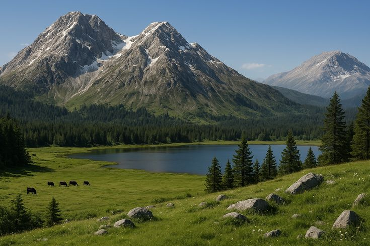
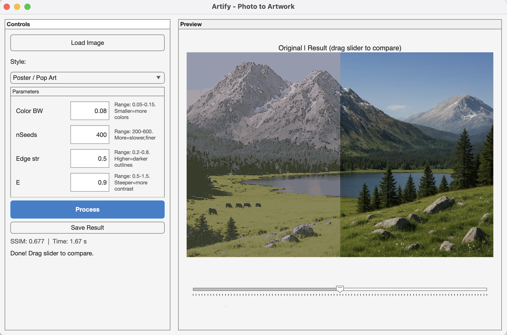
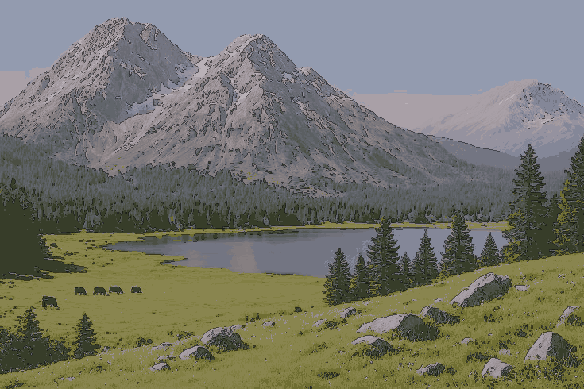
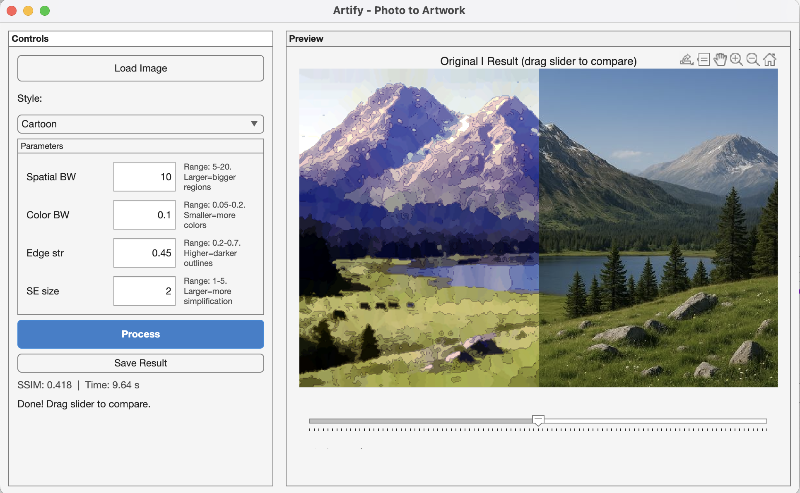
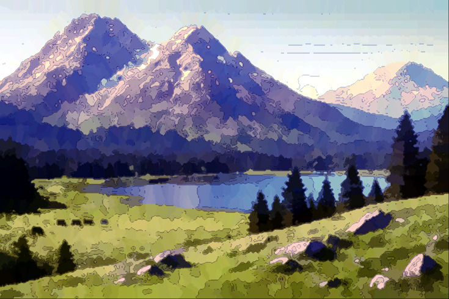
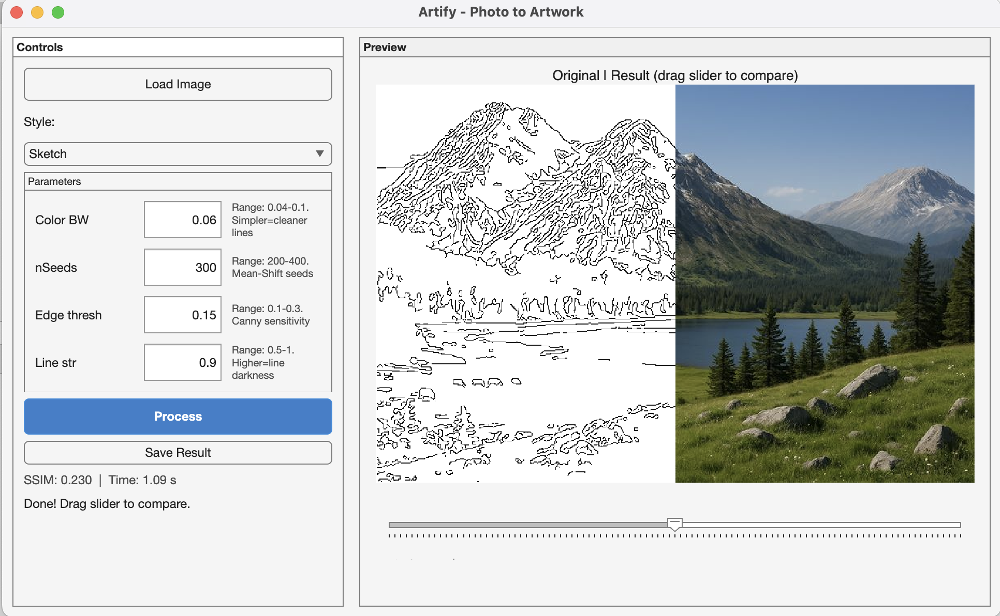
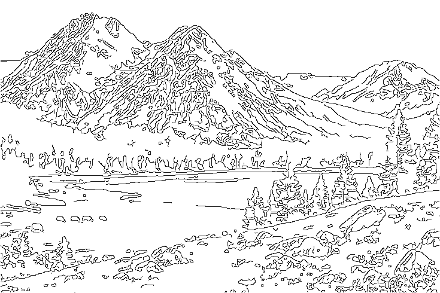

# Artify — Photo to Artwork

**DE4-DVS Project | Imperial College London | Spring 2026**

> Transform any photograph into a stylised artwork using classical image processing techniques — no neural networks required.


# Part 2 — Poster / Pop Art, Cartoon & Sketch


## Styles Overview

| Style | Visual Effect | Core Pipeline |
|-------|--------------|---------------|
| **Poster / Pop Art** | Flat colours, high contrast, bold outlines | Mean-Shift colour quant → contrast stretch → Sobel edges |
| **Cartoon** | Segmented regions, LoG outlines, equalised contrast | Morphological opening → Mean-Shift segmentation → LoG edges → histeq |
| **Sketch** | White paper with Canny pencil lines | Mean-Shift pre-smoothing → grayscale → Canny edges → invert |

All three styles share a **Mean-Shift core** (`meanShiftColorQuant.m` / `meanShiftSegmentation.m`), demonstrating that the same algorithm family produces very different visual results depending on feature space and downstream processing.

## How to Run

### Requirements
- MATLAB R2016a or later
- Image Processing Toolbox

### GUI Mode (recommended)

```matlab
artify_app
```

1. Click **Load Image** and select any `.jpg`, `.png`, `.bmp`, or `.tif` file.
2. Choose a style from the **Style** dropdown: Poster / Pop Art, Cartoon, or Sketch.
3. Adjust parameters if desired — range hints are shown next to each field.
4. Click **Process**.
5. Drag the **comparison slider** to reveal original vs. result side by side.
6. Click **Save Result** to export as `.png`.

### Script Mode (fallback, no uifigure required)

```matlab
main
```

Follow the dialog prompts to select an image, choose a style, set parameters, and optionally save.

### Direct Function Calls

Each style can also be called directly from the command line:

```matlab
img = im2double(imread('your_image.jpg'));

out = artify_poster(img, 0.08, 400, 0.5, 0.9);   % Poster / Pop Art
out = artify_cartoon(img, 10, 0.1, 0.45, 2);      % Cartoon
out = artify_sketch(img, 0.06, 300, 0.15, 0.9);   % Sketch

imshow(out);
```

All functions accept either a file path string or a pre-loaded `double` image matrix.

### File Structure

```
/
├── artify_app.m              # GUI application (R2016a+)
├── main.m                    # Script-mode entry point
├── getParameters.m           # Parameter dialog utility
├── meanShiftColorQuant.m     # Mean-Shift colour quantisation (RGB)
├── meanShiftSegmentation.m   # Mean-Shift segmentation (R,G,B,x,y)
├── artify_poster.m           # Style: Poster / Pop Art
├── artify_cartoon.m          # Style: Cartoon
├── artify_sketch.m           # Style: Sketch

```


## Style 1: Poster / Pop Art

### Pipeline

```
Input → Mean-Shift colour quantisation → Contrast stretching → Sobel edge detection → Edge overlay → Output
```
**Technical details:**
- **Contrast stretching:** \( s = 1/(1+(k/r)^E) \), where \( k = \text{mean}(r) \) expands midtones, \( E \) controls curve steepness (higher = stronger Pop Art contrast).
- **Edge overlay:** At edge pixels, \( C_{\text{out}} = C_{\text{in}} \times (1 - \text{edgeStrength}) \).
- **Why Sobel over Canny?** Sobel gives coarser, gradient-based edges that are less sensitive to texture; Canny would pick up fine grain in uniform regions (sky, grass), cluttering the flat graphic style.


**Parameters:**

| Parameter | Default | Range | Effect |
|-----------|---------|-------|--------|
| Color BW | 0.08 | 0.05–0.15 | Smaller = more colour clusters retained |
| nSeeds | 400 | 200–600 | More seeds = finer quantisation, slower |
| Edge strength | 0.5 | 0.2–0.8 | Higher = darker outlines |
| E (contrast) | 0.9 | 0.5–1.5 | Higher = steeper contrast curve |

### Evidence

**Original photograph:**



**Poster / Pop Art result** (Color BW=0.08, nSeeds=400, Edge str=0.5, E=0.9):




**SSIM: 0.677 | Processing time: 1.67 s**

The relatively high SSIM (0.677) reflects that the poster style preserves the overall luminance structure of the original — large regions map to coherent flat colours — while Sobel outlines reinforce boundaries without distorting the large-scale composition.


## Style 2: Cartoon

### Pipeline

```
Input → Morphological opening → Mean-Shift segmentation → LoG edge detection → Edge overlay → Histogram equalisation → Median filter → Output
```

**Technical details:**
- **Edge overlay:** \( C_{\text{out}} = C_{\text{in}} \times (1 - \text{edgeStrength}) \) at LoG edge pixels.
- **Why imopen before Mean-Shift?** Morphological opening removes small bright structures; without it, fine textures (skin, fabric) cause over-segmentation into many small regions. Pre-smoothing produces larger, cleaner "colour blocks" characteristic of cartoon style.
- **Why 5D feature space (R,G,B,x,y)?** Spatial coordinates ensure adjacent pixels of similar colour merge into one region, while distant pixels of similar colour stay separate — giving coherent spatial regions.

**Parameters:**

| Parameter | Default | Range | Effect |
|-----------|---------|-------|--------|
| Spatial BW | 10 | 5–20 | Larger = bigger merged regions |
| Color BW | 0.1 | 0.05–0.2 | Smaller = more colour variation retained |
| Edge strength | 0.45 | 0.2–0.7 | Higher = darker LoG outlines |
| SE size | 2 | 1–5 | Larger structuring element = more texture removed |

### Evidence

**Cartoon result** (Spatial BW=10, Color BW=0.1, Edge str=0.45, SE size=2):




**SSIM: 0.418 | Processing time: 9.64 s**

The lower SSIM (0.418) is expected and desirable: the cartoon style deliberately merges colour regions and redraws edges using LoG rather than preserving photographic texture. The morphological opening step (Lab 4) removes fine surface detail before segmentation, producing the characteristic clean-block look. Processing time is higher because Mean-Shift runs in 5D feature space rather than 3D colour-only.


## Style 3: Sketch

### Pipeline

```
Input → Mean-Shift colour quantisation → Grayscale → Canny edge detection → Invert → Output
```

**Technical details:**
- **Inversion:** \( \text{out} = 1 - \text{edges} \times \text{lineStrength} \), mapping edges to dark lines on white background (pencil-on-paper effect).
- **Why Mean-Shift before Canny?** Canny on the raw image detects both structural contours and surface texture (rock grain, grass). Mean-Shift quantisation acts as a low-pass filter, smoothing high-frequency detail so Canny finds only main boundaries — producing cleaner, more hand-drawn-like lines.

**Parameters:**

| Parameter | Default | Range | Effect |
|-----------|---------|-------|--------|
| Color BW | 0.06 | 0.04–0.1 | Larger = more pre-smoothing, cleaner lines |
| nSeeds | 300 | 200–400 | Mean-Shift seeds |
| Edge threshold | 0.15 | 0.1–0.3 | Canny sensitivity — higher = fewer, stronger edges |
| Line strength | 0.9 | 0.5–1.0 | Higher = darker lines |

### Evidence

**Sketch result** (Color BW=0.06, nSeeds=300, Edge thresh=0.15, Line str=0.9):




**SSIM: 0.230 | Processing time: 1.09 s**

The low SSIM (0.230) is intentional and expected. A pencil sketch is near-binary (black lines on white paper), which is structurally dissimilar to a colour photograph by construction. The metric confirms the style is maximally abstract — it captures structure, not colour. Canny edge detection clearly resolves the mountain ridgelines, tree silhouettes, and boulder shapes.


## Evaluation

### What works well

- **Three visually distinct outputs from one shared codebase.** Using Mean-Shift as the shared primitive demonstrates that the same algorithm produces very different aesthetics depending on feature space (colour-only vs. colour + spatial) and downstream processing.
- **SSIM as a meaningful style metric.** The spread from 0.23 (Sketch) to 0.68 (Poster) quantitatively captures how far each style departs from the photographic source, which maps directly to artistic intent.
- **Interpretable parameters.** Every stylistic choice is exposed with range hints, making the system transparent and tunable without requiring knowledge of the underlying algorithm.
- **Interactive GUI with live slider comparison.** The before/after slider makes it immediately clear that the application is working, without needing separate side-by-side figures.
- **Fast Poster and Sketch styles** at 1.67 s and 1.09 s respectively, usable in an interactive workflow.

### Limitations

- **Cartoon style is slow (~10 s).** Mean-Shift in 5D is O(n²) in feature points. Automatic downsampling mitigates this, but a compiled MEX or C++ implementation would be needed for real-time use.
- **Sketch over-detects texture edges.** At low Canny thresholds, rock grain and grass generate many fine lines, making the sketch appear busier than a hand-drawn equivalent. A Difference-of-Gaussians approach would better suppress texture while retaining structural contours.
- **Poster style on low-contrast images.** Sobel edges are weak on images with gradual tonal transitions such as fog or overcast sky. Adaptive thresholding would improve robustness.
- **No portrait-specific processing.** On human faces, the cartoon style produces inconsistent region segmentation around fine features such as eyebrows and lips.
- **No undo in the GUI.** Re-running overwrites the previous result with no history or comparison between parameter settings.

---

## Personal Statement — Yinuo Pang

### Contribution

I implemented the full pipeline for three artistic styles (Poster/Pop Art, Cartoon, Sketch), the two shared Mean-Shift modules (`meanShiftColorQuant.m`, `meanShiftSegmentation.m`), the GUI (`artify_app.m`), the script entry point (`main.m`), and the parameter dialog utility (`getParameters.m`).

### Design Decisions

**Why Mean-Shift as the shared core?** Lab 5 introduced Mean-Shift, and I wanted to show that the same algorithm family produces very different aesthetic results depending on the feature space. Using colour-only quantisation for Poster and Sketch versus 5D spatial-colour segmentation for Cartoon makes the three styles architecturally coherent while being visually distinct. It also meant I only needed to write and debug one underlying algorithm rather than three separate approaches.

**Why build a GUI?** The parameter space for image processing is inherently visual — you cannot know whether `spatialBW = 10` is correct without seeing the result. The slider comparison widget makes the feedback loop instant and also serves as clear, self-contained evidence that the application is working correctly.

**Why include SSIM?** After noticing that the three styles produce very different structural similarity scores (0.23 for Sketch, 0.42 for Cartoon, 0.68 for Poster), I realised SSIM was capturing artistic intent rather than just quality. A low SSIM for Sketch is a success criterion, not a failure. Including the metric with an explanation turns a potential criticism into a feature of the evaluation.

**Per-style design iterations:**

**Poster — Why Sobel over Canny?** I initially tried Canny for edge detection, but it produced too many fine texture edges in uniform regions (sky, grass, skin), making the poster look cluttered. Sobel's coarser gradient-based edges are less sensitive to texture and better suited to the flat, graphic style. The contrast formula \( s = 1/(1+(k/r)^E) \) uses \( k = \text{mean intensity} \) so midtones are expanded; I chose \( E \approx 0.9 \) for strong Pop Art contrast without over-saturating.

**Cartoon — Why imopen before Mean-Shift?** Without morphological pre-processing, Mean-Shift on the raw image over-segments fine textures (skin pores, fabric weave) into hundreds of tiny regions. I added imopen with a disk structuring element to remove small bright structures first; the segmentation then produces larger, cleaner regions that read as cartoon "colour blocks." The 5D feature space (R,G,B,x,y) ensures spatially adjacent pixels with similar colour merge into one region.

**Sketch — Why Mean-Shift before Canny?** Running Canny directly on the original image produced a noisy line drawing — rock grain, grass blades, and fabric texture all became lines. The Mean-Shift quantisation step acts as a low-pass filter: it smooths high-frequency detail so that Canny finds only structural boundaries (mountain ridgelines, object silhouettes). This ordering was the main fix for sketch quality; without it, the output looked like "texture noise" rather than a hand-drawn sketch.


### What I Learned

The biggest practical lesson was performance. Mean-Shift is O(n²) in the number of feature points, and downsampling before segmentation was necessary to make the Cartoon style interactive. I also learned that metrics designed for one domain can be meaningfully repurposed if you understand what they are measuring — SSIM for compression quality becomes a useful style-divergence indicator here.

The second lesson was about the purpose of pre-processing. The Mean-Shift quantisation step in the Sketch pipeline is not for artistic effect — it exists purely to reduce high-frequency noise before Canny, so that edge detection finds structural boundaries rather than texture. This kind of purposeful pre-processing is easy to overlook if you treat each pipeline step in isolation.

### Mistakes and What I Would Do Differently

**Design iterations that fixed suboptimal results (no failure images, but clear before/after in reasoning):**

- **Poster:** Early trials with Canny edges gave messy outlines in uniform areas. Switching to Sobel fixed this — the coarser edges suited the flat style.
- **Cartoon:** Direct Mean-Shift on the raw image produced fragmented regions. Adding imopen as a pre-step merged small structures and gave the clean-block look.
- **Sketch:** Canny on the original picked up texture as well as structure. Adding Mean-Shift quantisation before Canny suppressed texture and kept only main contours.
- **Cartoon performance:** On a 1080p image, Mean-Shift in 5D initially took over 2 minutes. I added automatic downsampling when \( h \times w > 100{,}000 \) to bring it down to ~10 s — a necessary trade-off between resolution and interactivity.

The Sketch style produces too many fine texture edges because Canny does not distinguish between structural contours and surface texture. A Difference-of-Gaussians or coherence-enhancing diffusion approach would produce more selective, artist-like line drawings. If I were to redo this, I would invest more time on the Sketch pipeline specifically.

I would also coordinate with teammates earlier to agree on a shared GUI or common top-level entry point. Having three independent implementations means the submission represents parallel effort rather than an integrated system. Dividing responsibility by style rather than by layer (algorithm / interface / evaluation) was pragmatic given the timeline, but not the ideal engineering approach.

### Reflection

This project reinforced that classical image processing — without any machine learning — is both powerful and fully interpretable. Every output produced can be explained step by step using concepts from the course labs: Lab 2 (colour spaces), Lab 3 (edge detection, histogram operations), Lab 4 (morphology), Lab 5 (Mean-Shift). That interpretability is something neural style transfer cannot offer. The project also gave me a much better intuition for when each technique is appropriate: morphological opening before segmentation, Mean-Shift before Canny, contrast stretching after quantisation — the ordering of steps matters as much as the steps themselves.


